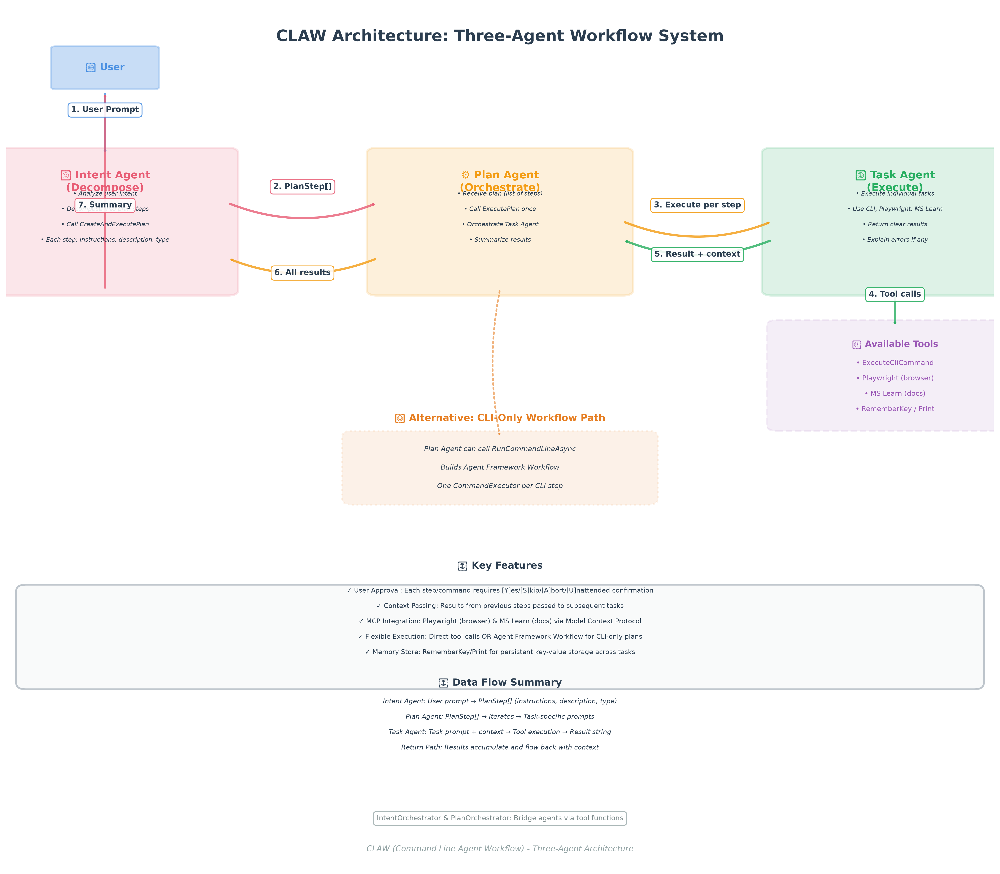

# CLAW Architecture Quick Reference

## 📊 Visual Architecture



---

## 🎯 Agent Summary

| Agent | Role | Key Responsibility | Tools |
|-------|------|-------------------|-------|
| **Intent Agent** 🧠 | Decompose | Analyze user intent → Create PlanStep[] | CreateAndExecutePlanAsync |
| **Plan Agent** ⚙️ | Orchestrate | Execute plan step-by-step → Coordinate Task Agent | ExecutePlanAsync, RunCommandLineAsync |
| **Task Agent** 🔨 | Execute | Run individual tasks with tools → Return results | CLI, Playwright, MS Learn, Memory |

---

## 🔄 Execution Sequence

```
User Prompt
	↓
[1] Intent Agent
	↓ (PlanStep[])
[2] Plan Agent
	↓ (per step + context)
[3] Task Agent
	↓ (tool calls)
[4] Tools (CLI, Playwright, MS Learn)
	↓ (results)
[5] Task Agent → Plan Agent → Intent Agent → User
```

---

## 🧩 Data Structures

### PlanStep
```json
{
  "instructions": "Detailed execution instructions",
  "description": "Human-readable summary",
  "type": "cli | browser | reasoning"
}
```

### ClawTask (CLI Workflow)
```json
{
  "executable": "cmd | pwsh | git | dotnet",
  "arguments": "command arguments",
  "description": "Task description"
}
```

---

## 🛠️ Available Tools (Task Agent)

### Core Tools
- **ExecuteCliCommandAsync** - Run CLI/PowerShell commands
- **RememberKeyAsync** - Store key-value pairs
- **PrintRememberKeyValues** - Display stored values

### MCP Integrations
- **Playwright MCP** 🌐
  - Browser automation
  - Transport: stdio (`npx @playwright/mcp@latest`)

- **MS Learn MCP** 📚
  - Microsoft documentation access
  - Transport: HTTP (`https://learn.microsoft.com/api/mcp`)

---

## ⚡ User Interaction Points

### Step Approval Prompt
```
Execute? [Y]es / [S]kip / [A]bort / [U]nattended >
```

| Option | Action |
|--------|--------|
| **[Y]** | Execute this step |
| **[S]** | Skip this step, continue to next |
| **[A]** | Abort entire execution |
| **[U]** | Enable unattended mode - auto-execute all remaining steps |

### Where Prompts Appear
1. **Plan Agent:** Before each plan step
2. **Task Agent:** Before each CLI command execution
3. **Workflow Path:** Before each CommandExecutor step

---

## 🎨 Agent Instructions (Condensed)

### Intent Agent 🧠
```
1. Analyze user intent
2. Decompose into PlanStep[]
3. Call CreateAndExecutePlanAsync ONCE
4. Summarize results after execution
⚠️ Never plan destructive commands without warnings
```

### Plan Agent ⚙️
```
1. Receive plan (list of steps)
2. Call ExecutePlanAsync ONCE with complete plan
3. Each step → Task Agent execution
4. Summarize all results
Alternative: RunCommandLineAsync for CLI-only plans
```

### Task Agent 🔨
```
1. Receive task + context from previous steps
2. Execute using available tools
3. Return clear, concise result
4. Explain errors and suggest alternatives
```

---

## 🔗 Orchestrator Pattern

```csharp
// Intent → Plan
IntentOrchestrator.CreateAndExecutePlanAsync(PlanStep[] steps)
	└─> Passes to Plan Agent

// Plan → Task  
PlanOrchestrator.ExecutePlanAsync(PlanStep[] steps)
	└─> Iterates steps
		└─> For each: Task Agent.RunAsync(taskPrompt, session)
```

---

## 📋 Alternative Workflow Path

### CLI-Only Workflow
When all steps are CLI commands:

```
Plan Agent
	↓
RunCommandLineAsync(ClawTask[] tasks)
	↓
Build Agent Framework Workflow
	├─> CommandExecutor (Step 1)
	├─> CommandExecutor (Step 2)
	└─> CommandExecutor (Step N)
	↓
InProcessExecution.RunStreamingAsync()
```

**Benefits:**
- Structured workflow with explicit edges
- CommandCompletedEvent for each step
- Better suited for pure CLI automation

---

## 🔐 Safety Features

| Feature | Description |
|---------|-------------|
| **User Approval** | Every step requires explicit [Y/S/A/U] |
| **Unattended Mode** | Optional auto-execution for trusted operations |
| **Timeout Protection** | CLI commands timeout after 60 seconds |
| **Process Isolation** | CLI runs in separate process |
| **Error Reporting** | Clear error messages with alternatives |
| **Destructive Command Warning** | Intent Agent flags dangerous operations |

---

## 📊 Context Flow

```
Step 1 Execution
	↓ (result)
Step 2 Execution (receives Step 1 result)
	↓ (result + context)
Step 3 Execution (receives Step 1 & 2 context)
	↓ (accumulated results)
Final Summary to User
```

**Context Passing:**
- Results accumulate in `previousContext` string
- Each Task Agent session receives prior context in prompt
- Enables dependent operations and informed decisions

---

## 🚀 Usage Example

### User Request
```
"Clone the Semantic Kernel repository and build the solution"
```

### Intent Agent Generates
```json
[
  {
	"instructions": "Clone repository using git clone",
	"description": "Clone Semantic Kernel repository",
	"type": "cli"
  },
  {
	"instructions": "Navigate to solution directory",
	"description": "Change to cloned directory",
	"type": "cli"
  },
  {
	"instructions": "Restore NuGet packages using dotnet restore",
	"description": "Restore dependencies",
	"type": "cli"
  },
  {
	"instructions": "Build solution using dotnet build",
	"description": "Build the solution",
	"type": "cli"
  }
]
```

### Execution Flow
```
Plan Agent receives 4 steps
├─> Step 1: git clone (user approves)
│   └─> Task Agent executes → returns clone status
├─> Step 2: cd directory (user approves)
│   └─> Task Agent executes → returns navigation status
├─> Step 3: dotnet restore (user approves)
│   └─> Task Agent executes → returns restore output
└─> Step 4: dotnet build (user approves)
	└─> Task Agent executes → returns build results

Summary returned to user with all outputs
```

---

## 🧪 Testing the Architecture

### Run Sample
```csharp
await SimpleClawSession.RunAsync();
```

### Verify Components
1. **MCP Servers Load:** Check Playwright & MS Learn tool counts
2. **Intent Agent:** Verify prompt decomposition
3. **Plan Agent:** Verify step orchestration
4. **Task Agent:** Verify tool execution
5. **User Approval:** Test Y/S/A/U options
6. **Context Passing:** Verify results flow between steps

---

## 📚 References

- **Main Class:** `SimpleClawSession.cs`
- **Full Documentation:** [CLAW_Architecture_Documentation.md](CLAW_Architecture_Documentation.md)
- **Architecture Diagram:** [CLAW_Architecture_Diagram.png](CLAW_Architecture_Diagram.png)
- **Framework:** Microsoft Agents AI
- **Protocol:** Model Context Protocol (MCP)

---

## 🎓 Key Takeaways

1. **Three-Agent Pattern:** Intent → Plan → Task separation
2. **Tool Integration:** MCP enables extensible tool ecosystem
3. **User Control:** Granular approval with unattended option
4. **Context Awareness:** Results flow naturally between steps
5. **Flexible Execution:** Direct tools OR workflow path
6. **Safety First:** Multiple safety mechanisms built-in

---

**💡 Pro Tip:** Use **[U]nattended mode** for long-running trusted operations to avoid repeated prompts!
